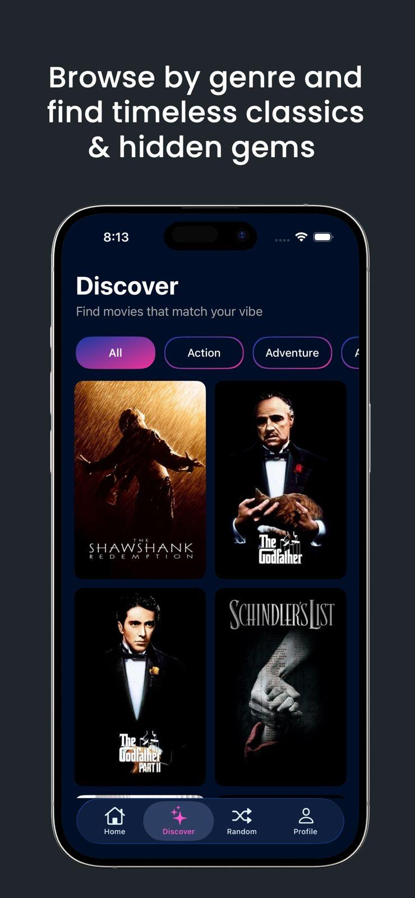
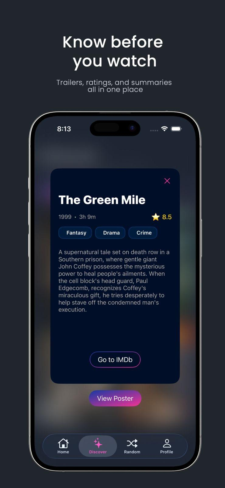
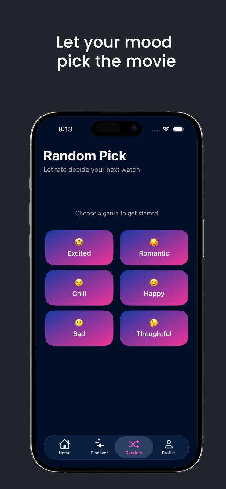
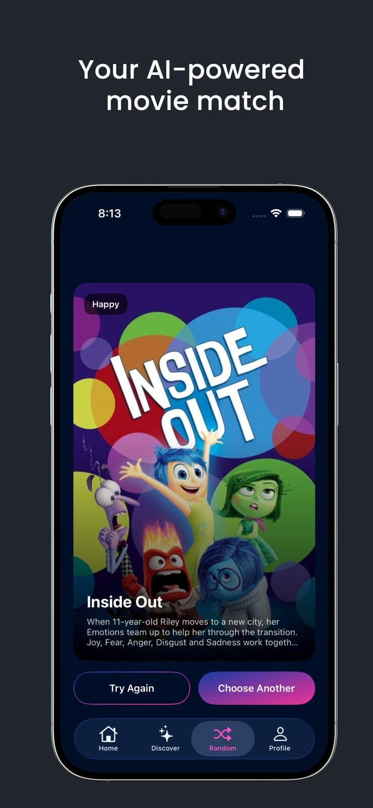
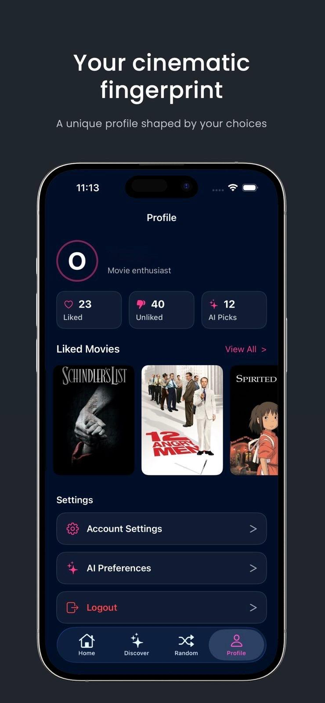

# SwipeFlick 🎬

Swipe-based movie discovery app for iOS. Built with UIKit + MVVM, powered by TMDb data,
Firebase (Auth / Firestore / Functions) and AI recommendations via Firebase AI (Gemini).

> Built during **Turkcell Geleceği Yazanlar Bootcamp 4.5** and **published on the App Store**
> (since removed). This repository is a public showcase of the source.

---

## Screenshots

<table>
  <tr>
    <td align="center"><br><sub><b>Home - Swipe</b></sub></td>
    <td align="center"><br><sub><b>Discover</b></sub></td>
    <td align="center"><br><sub><b>Movie Detail</b></sub></td>
  </tr>
  <tr>
    <td align="center"><br><sub><b>Random - Mood Picker</b></sub></td>
    <td align="center"><br><sub><b>Random - AI Match</b></sub></td>
    <td align="center"><br><sub><b>Profile</b></sub></td>
  </tr>
</table>

---

## What It Does

Helps you decide what to watch in seconds instead of hours — by combining real catalog
data (TMDb) with your own taste (likes / dislikes, moods) and an AI layer that proposes
a single, relevant pick.

**Core features**
- **Onboarding** — paged intro flow with localized copy.
- **Home** — top-rated movies, swipe card interactions.
- **Discover** — filter by one or multiple genres, paginated grid.
- **Random** — mood-based randomizer with per-mood genre mapping and animated UI.
- **Movie Detail** — poster, overview, metadata, external IDs, trailers.
- **Profile** — like/dislike stats, AI preferences, account settings.
- **Auth** — email/password login, register, password reset, account deletion.
- Offline-safe UI states (empty / loading / error) and lightweight image caching.

---

## AI Recommendations

Uses Firebase AI (Gemini) with a compact prompt built from your likes/dislikes, watched
genres, optional AI preferences (pace, mood, languages) and the current context
(mood or discover filters).

- `Managers/Gemini/GeminiRecommendationService.swift` — system prompt enforces exactly one
  title, no extra text, excludes disliked titles, localizes when possible.
- **Sanitization** — de-duplicates inputs, trims whitespace, caps list sizes, strips
  numbering/quotes from the model output.
- **Validation** — rejects empty/ambiguous output; blocks titles matching the disliked
  list after locale-aware normalization.
- **Reliability** — retry with backoff on 429 / 5xx / network errors.
- `GeminiRecommendationConfiguration` uses low temperature and short output tokens for
  deterministic, punchy results.

---

## Architecture

MVVM with module-scoped folders. Feature VCs own view models through protocol types
(`HomeVMProtocol`, `DiscoverVMProtocol`, …) and bind via closures
(`onMoviesUpdated`, `onLoadingStateChanged`, `onError`).

```
SwipeFlick/
├── Application/    AppDelegate, SceneDelegate, global setup
├── Modules/        Splash, Onboarding, Home, Discover, Random, Profile, Auth
├── Common/         Reusable views + shared MovieDetail component
├── Managers/
│   ├── Network/    URLSession layer, TMDb endpoints, image loader
│   ├── Firebase/   Auth, Firestore user prefs, Functions client
│   └── Gemini/     Firebase AI config, request/response models
├── Model/          Movie, Genre, MovieDetail DTOs
├── Extensions/     UIKit + String helpers
├── Resources/      Assets and localization
└── Support/        Info.plist
```

**Networking** — `Endpoint` composes paths and query items and refuses to build a URL if
the TMDb key is missing. `NetworkManager` centralizes decoding and error mapping
(invalidURL / response / noData / httpError). `ImageLoader` uses `NSCache`.

**Firebase** — `FirebaseAuthManager` implements `AuthManaging`;
`FirebaseUserPreferencesManager` stores per-user likes/dislikes and AI prefs in Firestore;
`TmdbKeyService` calls the `getTmdbKey` callable function.

---

## TMDb Key Handling

The TMDb API key is **not embedded** in the app, binary or plist. On launch `SplashVM`
calls `TmdbKeyService.fetchKey()`, which invokes a Firebase Cloud Function backed by
Secret Manager. The key is cached in memory only (`TmdbKeyStore`) and appended to TMDb
requests by `Endpoint`. If the key isn't ready, `Endpoint.url` is `nil` and calls fail fast.

The Cloud Function (`getTmdbKey`) lives in a separate backend repo and is not included here.

---

## Running It Yourself

This repo is published as a **source showcase** — it will not run as-is, because the
Firebase configuration and the backend function are intentionally not included.

To build it against your own infrastructure:

1. Open `SwipeFlick.xcodeproj` in Xcode 16+ (iOS 18.0 deployment target).
2. Add the Firebase SDK via SwiftPM: `https://github.com/firebase/firebase-ios-sdk`
   (`FirebaseCore`, `FirebaseAuth`, `FirebaseFirestore`, `FirebaseFunctions`, `FirebaseAI`).
3. Create your own Firebase project, download `GoogleService-Info.plist` and place it at
   `SwipeFlick/GoogleService-Info.plist`. See `GoogleService-Info.plist.example` for the
   expected shape. (This file is gitignored.)
4. Deploy your own `getTmdbKey` callable function holding a TMDb API key, or replace
   `TmdbKeyService` with your own key source.
5. Set your own signing team in project settings.

---

## Tech Stack

`Swift` · `UIKit` · `MVVM` · `Swift Package Manager` · `Firebase Auth` ·
`Cloud Firestore` · `Cloud Functions` · `Firebase AI (Gemini)` · `TMDb API`

---

## Credits

This product uses the TMDb API but is not endorsed or certified by TMDb.
